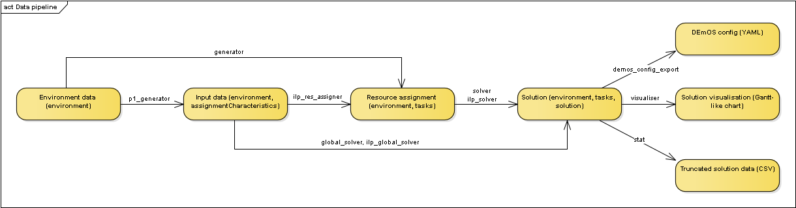

This repository contains source code of tools created for the <b>"Scheduling of the safety-critical workloads for embedded systems"</b> project and documents related to this project.

<h1>Contents</h1>
<ol>
	<li>[Repository structure](#repository-structure)</li>
	<li>[Available tools](#available-tools)
		<ol>
         <li>[p1_generator](#p1_generator)</li>
			<li>[generator](#generator)</li>
			<li>[solver](#solver)</li>
         <li>[global_solver](#global_solver)</li>
			<li>[ilp_solver](#ilp_solver)</li>
			<li>[ilp_res_assigner](#ilp_res_assigner)</li>
			<li>[ilp_global_solver](#ilp_global_solver)</li>
			<li>[visualiser](#visualiser)</li>
			<li>[stat](#stat)</li>
			<li>[demos_config_export](#demos_config_export)</li>
			<li>[Helper scripts](#helper-scripts)</li>
		</ol>
	</li>
	<li>[Compiling](#compiling)</li>
	<li>[Data format](#data-format)</li>
</ol>

<h2>Repository structure</h2>
<ul>
	<li><b>data:</b> contains example data that can be used with the tools.</li>
	<li><b>doc:</b> contains documents related to the tools.</li>
	<li><b>experiments:</b> contains files from conducted experiments, such as experiment descriptions, helper scripts, input and output data, etc.</li>
	<li><b>tools:</b> contains helper scripts and source code of the tools (subdirectory <i>src</i>).</li>
</ul>

<h2>Available tools</h2>
All of the provided tools expect a JSON file on their input. The tools then output the same JSON with additional data based on the purpose of the used tool. No data will be deleted between the input and the output. However, some fields can be overwritten (for example, if a JSON already containing a solution is provided as an input to a solver, then the solution will be overwritten). For details about the JSON structure, please see the [Data format](#data-format) section of this readme. Unless stated otherwise, if no input file is specified, then the tools read input from stdin. Similarly, if no output file is specified, then the tools write their output to stdout. This allows for chaining of the tools in a single command, for example:

<code>generator.exe --input environment.json | solver.exe | visualiser.exe --output random_instance.png</code>

generates a random problem instance of the scheduling phase, solves it with heuristic solver, and creates a visualisation of that solution.

To better understand how the tools work, the following diagram illustrates how they fit together to form a data pipeline:

<h4>p1_generator</h4>
A generator of input data for the resource assignment phase (phase 1) of the problem. The output from this generator can be used with <i>ilp_res_assigner</i> and <i>ilp_global_solver</i>. Generates <i>&lt;task_count&gt;</i> of tasks with a random length that is uniformly distributed between <i>&lt;min-length&gt;</i> and <i>&lt;max-length&gt;</i>. Tasks are generated based on provided benchmark data. [TODO: details about benchmark data and expected file format]

Input JSON requirements: environment

Output JSON will contain: environment, assignment_characteristics

Arguments:
<pre>
--environment &lt;file&gt;                                input file [stdin]
--benchmark-data &lt;file&gt;                             csv file containing benchmark data   
--output &lt;file&gt;                                     output file [stdout]
--min-length &lt;length&gt;                               minimal length of a task [10]
--max-length &lt;length&gt;                               maximal length of a task [50]
--task-count &lt;count&gt;                                number of tasks to generate [10]
</pre>

<h4>generator</h4>
A generator of input data for the scheduling phase (phase 2) of the problem. The output from this generator can be used with <i>solver</i> and <i>ilp_solver</i>. Generates <i>&lt;task_count&gt;</i> of tasks with a random length that is uniformly distributed between <i>&lt;min-length&gt;</i> and <i>&lt;max-length&gt;</i>. Each generated task has a <i>&lt;coprocessor-probability&gt;</i>% chance of using a coprocessor.

Input JSON requirements: environment

Output JSON will contain: environment, tasks

Arguments:
<pre>
--environment &lt;file&gt;                                input file [stdin]
--output &lt;file&gt;                                     output file [stdout]
--min-length &lt;length&gt;                               minimal length of a task [1]
--max-length &lt;length&gt;                               maximal length of a task [40]
--coprocessor-probability &lt;probability (0-100)&gt;     probability, that a generated task will use a coprocessor [30]
--task-count &lt;count&gt;                                number of tasks to generate [12]
</pre>

<h4>solver</h4>
Heuristic solver of the scheduling phase (phase 2) of the problem.

Available heuristic algorithms:
<table>
	<tr><th>Identifier</th><th>Algorithm</th></tr>
	<tr><td>0</td><td>Longest tasks first</td></tr>
	<tr><td>1</td><td>Random task order</td></tr>
</table>

Input JSON requirements: environment, tasks

Output JSON will contain: environment, tasks, solution

Arguments:
<pre>
--input &lt;file&gt;                     input file [stdin]
--output &lt;file&gt;                    output file [stdout]
--method &lt;algorithm identifier&gt;    identifier of the heuristic algorithm to be used [0]
</pre>

<h4>iglobal_solver</h4>
Heuristic solver of the global problem - handles both resource assignment and scheduling. This solver is currently only capable of creating random schedules.

Input JSON requirements: environment, assignmentCharacteristics

Output JSON will contain: environment, tasks, solution

<pre>
--input &lt;file&gt;                input file [stdin]
--output &lt;file&gt;               output file [stdout]
</pre>

<h4>ilp_solver</h4>
ILP solver of the scheduling phase (phase 2) of the problem. If the model is infeasible, the solver will, by default, compute IIS and write the model to a file.

Input JSON requirements: environment, tasks

Output JSON will contain: environment, tasks, (assignmentCuts), solution

<pre>
--input &lt;file&gt;          input file [stdin]
--output &lt;file&gt;         output file [stdout]
--no-iis-output         if the model is infeasible, the ILP model will not be written into a file (if no parameter for generating assignment cuts is specified, the solver will not compute IIS)
--generate-naive-cuts   if the model is infeasible, Bender's cut of the infeasible resource assignment will be added to the output JSON ("naive" cut method)
--generate-better-cuts  if the model is infeasible, Bender's cut of the infeasible resource assignment will be added to the output JSON ("better" cut method)
</pre>

<h4>ilp_res_assigner</h4>
ILP solver of the resource assignment phase (phase 1) of the problem. If the model is infeasible, the solver will by default compute IIS and write the model to a file.

Input JSON requirements: environment, assignmentCharacteristics, (assignmentCuts)

Output JSON will contain: environment, tasks, (assignmentCuts will be preserved from input JSON)

<pre>
--input &lt;file&gt;    input file [stdin]
--output &lt;file&gt;   output file [stdout]
--no-iis-output   if the model is infeasible, the solver will not compute IIS and the ILP model will not be written into a file
</pre>

<h4>ilp_global_solver</h4>
ILP solver of the global problem - handles both resource assignment and scheduling. If the model is infeasible, the solver will by default compute IIS and write the model to a file.

Input JSON requirements: environment, assignmentCharacteristics

Output JSON will contain: environment, tasks, solution

<pre>
--input &lt;file&gt;                input file [stdin]
--output &lt;file&gt;               output file [stdout]
--no-iis-output               if the model is infeasible, the solver will not compute IIS and the ILP model will not be written into a file
--no-schedule-optimization    disables optimization of total schedule length as a secondary objective
</pre>

<h4>visualiser</h4>
Solution visualiser, that transforms a JSON with solution to an image file containing a Gantt-like chart. Supported image formats are BMP and PNG.

Input JSON requirements: environment, solution

This tool does not produce JSON output. Instead, it outputs an image file. Output to stdout is not supported.

Arguments:
<pre>
--input &lt;file&gt;    input file [stdin]
--output &lt;file&gt;   output image file
</pre>

<h4>stat</h4>
Solution data aggregator that transforms a JSON with solution to a single line of CSV data.

Input JSON requirements: environment, solution

This tool does not produce JSON output. Instead, it outputs CSV data. For details about the output columns, run it with <code>--no-input --write-header</code> arguments.

Arguments:
<pre>
--input &lt;file&gt;          input file [stdin]
--output &lt;file&gt;         output file (output is appended to this file) [stdout]
--write-header          write CSV header before data 
--no-input              do not wait for/ignore input data
</pre>

<h4>demos_config_export</h4>
Transforms a JSON with solution to a YAML configuration for the DEmOS scheduler. 

Notes:
<ul>
	<li>Only a single process per partition is supported. The budget of this process is taken from its task definition, not the window assignment.</li>
	<li>DEmOS identifies CPUs (processors) only by their index. When exporting the config file, demos_config_export follows the ordering of processors in the environment section of the input JSON. The first processor in environment.processors starts at index 0, the second at index n (n being the number of processing units of the first processor), and so on. Coprocessors in the list are ignored.</li>
</ul>

Input JSON requirements: environment, tasks, solution

This tool does not produce JSON output. Instead, it outputs DEmOS config in YAML format.

Arguments:
<pre>
--input &lt;file&gt;    input file [stdin]
--output &lt;file&gt;   output file [stdout]
</pre>

<h3>Helper scripts</h3>
Helper scripts come in Windows (.bat) and Linux (.sh) variant unless otherwise specified. The scripts expect that the compiled tools are in PATH environmental variable. The following helper scripts are provided:

<ul>
	<li><b>better_cuts:</b> uses Bender's cuts to solve the global problem with ilp_res_assigner and ilp_solver. Uses the "better cuts" method of generating cuts. Stops when either ilp_solver finds a solution, ilp_res_assigner can no longer find a feasible solution, or iteration limit is reached (by default 1000 iterations). Syntax: <code>./better_cuts.sh &lt;input file&gt; &lt;output file&gt;</code></li>
	<li><b>naive_cuts:</b> does the same as <i>better_cuts</i> except for using the "naive cuts" method.</li>
	<li><b>random_instance:</b> Windows only, not supported by the author.</li>
</ul>

<h2>Compiling</h2>
Compiling requires gcc capable of compiling C++14 standard (tested with gcc version 9.3.0), and GNU make.

Non-ILP tools have no external dependencies and can be compiled by changing into <code>tools/src</code> directory and executing <code>make</code>.

ILP tools require gurobi to be installed. To compile ILP tools, first ensure that the variable GUROBI_HOME in the <code>tools/src/Makefile</code> file contains a path to where gurobi is installed on the system (this should be the gurobi directory that has bin, lib, docs, and other subdirectories). Once this variable is correctly set, change to <code>tools/src</code> directory and execute <code>make ilp</code>. ILP tools were tested with gurobi 9.0 and 9.1.

If you wish to compile all tools at once, it is also possible to execute <code>make all</code> in the <code>tools/src</code> directory. Note that this requires the GUROBI_HOME variable to be correctly set in the Makefile. To speed up the compiling, it might be desirable to compile several tools at once. To do this, execute the <code>make</code> command with <code>-j#</code> argument, where # is the number of tools to be compiled simultaneously. A good value is the number of CPU threads on your computer. Example: <code>make all -j4</code>

Once the compiling has succeeded, the compiled tools will be in the <code>tools/bin</code> directory.

Compilation with other C++ compilers should be possible but is not supported by the author.

<h2>Data format</h2>
The content of the JSONs that the tools use is best explained by an example. The JSON requirements and output referenced in the [Available tools](#available-tools) section of this readme refer to the names of the top-level object in the JSON. The following example contains all posible field the provided tools recognize, but some fields that repeat multiple times have been truncated for brevity. The full version of this example JSON without comments can be found [here](data/all_fields.json).

<pre>
{
  "environment":{                    // environment data       
      "majorFrameLength":200,        // major frame length in ms (integer)
      "problemVersion":1,            // problem version - the tools should produce an error if used with unsupported problem version
      "processors":[                 // list of processors
         {                           // processor 0 (demos_config_export will use CPU indices 0-3 for this processor)
            "name":"A53",            // processor name 
            "processingUnits":4,     // number of available processing units (integer)
            "type":"main_processor"  // type: main_processor or coprocessor
         },
         {                           // processor 1 (demos_config_export will use CPU indices 4-5 for this processor)
            "name":"A72",
            "processingUnits":2,
            "type":"main_processor"
         },
         {                           // processor 2 (demos_config_export will ignore this processor because it is a coprocessor)
            "name":"GPU",
            "processingUnits":2,
            "type":"coprocessor"
         }
      ]
	},

   "assignmentCharacteristics":[              // tasks and their possible assignments to resources (input for phase 1)
      {                                       // task 0
         "task":"T1",                         // task name 
         "command":"yes >/dev/null",          // optional: command to be executed (for DEmOS config)
         "resourceAssignments":[              // list of possible assignments to resources
            {                                 // possible assignment 1:
               "energyConsumption":20,        //   has this energy consumption score (integer)
               "length":80,                   //   has this processing time in ms (integer)
               "processors":[                 //   is an assignment to the following processors:
                  {
                     "processingUnits":1,     //     requires 1 processing unit (integer)
                     "processor":"A53"        //     on this processor (processor must be defined in environment.processors)
                  }
               ]
            },

            {                                 // possible assignment 2
               "energyConsumption":10,
               "length":90,
               "processors":[
                  {
                     "processingUnits":1,
                     "processor":"A72"
                  }
               ]
            },

            {                                 // possible assignment 3:
               "energyConsumption":15,
               "length":75,
               "processors":[                 //   assignment to multiple different processors simultaneously
                  {
                     "processingUnits":1,
                     "processor":"A72"
                  },
                  {
                     "processingUnits":1,
                     "processor":"GPU"
                  }
               ]
            }
         ]
      },
      {                                       // task 1
         "command":"yes >/dev/null",
         "task":"T2",
         "resourceAssignments":[ ... ]
      },
      {                                       // task 2
         "command":"yes >/dev/null",
         "task":"T3",
         "resourceAssignments":[ ... ]
      },
      {                                       // task 3
         "command":"yes >/dev/null",
         "task":"T4",
         "resourceAssignments":[ ... ]
      },
      {                                       // task 4
         "command":"yes >/dev/null",
         "task":"T5",
         "resourceAssignments":[ ... ]
      }
   ],

   "assignmentCuts":[                     // resource assignment groups, which cannot occur simultaneously
      [                                   // group 1: T1[1], T2[1], T3[0] - these assignments together are not allowed
         {
            "assignmentIndex":0,          // item index from assignmentCharacteristics.resourceAssignment array
            "task":"T3"                   // assignmentCharacteristics.task
         },
         {
            "assignmentIndex":1,
            "task":"T1"
         },
         {
            "assignmentIndex":1,
            "task":"T2"
         }
      ],

      [                                    // group 2: T1[1], T2[2], T3[0] - these assignments together are not allowed
         {
            "assignmentIndex":0,
            "task":"T3"
         },
         {
            "assignmentIndex":1,
            "task":"T1"
         },
         {
            "assignmentIndex":2,
            "task":"T2"
         }
      ]
   ],

   "tasks":[                            // tasks with fixed resource assignment: input for scheduling phase (phase 2)
      {
         "assignmentIndex":0,           // index from assignmentCharacteristics.resourceAssignment array which corresponds to this data
         "command":"yes >/dev/null",    // optional: command (for DEmOS config)
         "length":80,                   // processing time in ms (integer)
         "name":"T1",                   // task name
         "processors":[                 // task is assigned to these processors (multiple processors can be specified at a time)
            {
               "processor":"A53",       // on this processor (processor must be defined in environment.processors)
               "processingUnits":1      // 1 processing unit is required
            }
         ]
      },
      {
         "assignmentIndex":1,
         "command":"yes >/dev/null",
         "length":70,
         "name":"T2",
         "processors":[
            {
               "processor":"A72",
               "processingUnits":1
            }
         ]
      },
      { ... },
      { ... },
      { ... }
   ],

   "solution":{                              // solution data: final schedule        
      "feasible":true,                       // is the solution feasible? if not, array of windows will be empty
      "solutionTime":1,                      // how long it took the solver to generate this solution (in ms)
      "solverMetadata":null,                 // additional solver metadata, specific to every solver (it would be an object containing key-value pairs if it was not null in this case)
      "solverName":"ILP Solver",             // name of the solver that generated this solution
      "windows":[                            // solution consists of these windows:
         {                                   //   window 0:
            "length":134,                    //     its length in ms
            "tasks":[                        //     what should be executed on each resource in this window
               {                             //      window 0 item 0:
                  "length":80,               //        processing time in ms
                  "processingUnit":0,        //        on this processing unit (this index starts at 0 for each processor separately)
                  "processor":"A72",         //        of this processor
                  "start":0,                 //        starts at this time of the window
                  "task":"T3"                //        its this task - if a task has to be executed on multiple processors or processing units within a single window, it would have multiple "item" entries in the given window - does not happen in this case
               },
               {                             //      window 0 item 1
                  "length":60,
                  "processingUnit":0,
                  "processor":"A53",
                  "start":0,
                  "task":"T4"                
               },
               {                             //      window 0 item 2
                  "length":80,
                  "processingUnit":1,
                  "processor":"A53",
                  "start":0,
                  "task":"T1"
               },
               {                             //      window 0 item 3
                  "length":70,
                  "processingUnit":2,
                  "processor":"A53",
                  "start":0,
                  "task":"T5"
               },
               {                             //      window 0 item 4
                  "length":70,
                  "processingUnit":1,
                  "processor":"A72",
                  "start":0,
                  "task":"T2"
               }
            ]
         }
      ]
   }
}
</pre>