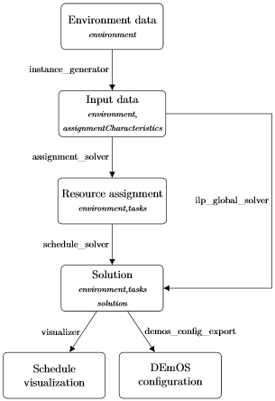

# Safety-critical scheduling

- [Safety-critical scheduling](#safety-critical-scheduling)
  - [JPDC data](#jpdc-data)
  - [Available tools](#available-tools)
      - [instance\_generator](#instance_generator)
      - [ilp\_global\_solver](#ilp_global_solver)
      - [assignment\_solver](#assignment_solver)
      - [schedule\_solver](#schedule_solver)
      - [visualizer](#visualizer)
      - [demos\_config\_export](#demos_config_export)
  - [Compiling](#compiling)
  - [Data format](#data-format)

This repository contains source-codes and data collected during experiments with thermal-aware safety-critical scheduling.

## JPDC data

The preliminary study and experiments with Linux scheduler [DEmOS](https://github.com/CTU-IIG/demos-sched) was published and presented at RTCSA 2021 conference

- O. Benedikt et al., "Thermal-Aware Scheduling for MPSoC in the Avionics Domain: Tooling and Initial Results," 2021 IEEE 27th International Conference on Embedded and Real-Time Computing Systems and Applications (RTCSA), 2021, pp. 159-168, doi: [10.1109/RTCSA52859.2021.00026](https://ieeexplore.ieee.org/document/9545290/).

The extended version with new optimizers and experiments was submitted to Journal of Systems Architecture and is currently under review. The optimizers source codes can be found in `tools/src/JPDC-solvers` folder; specifically, the optimizers presented in the JPDC study include

| **Optimizer** | **Source code**                                                    |
|---------------|--------------------------------------------------------------------|
| ILP-SM        | [`tools/src/JPDC-solvers/ILP-SM-I`](tools/src/JPDC-solvers/ILP-SM-I) |
| QP-LR-UB      | [`tools/src/JPDC-solvers/QP-LR-UB`](tools/src/JPDC-solvers/QP-LR-UB) |
| BB-LR         | [`tools/src/JPDC-solvers/BB`](tools/src/JPDC-solvers/BB)             |
| BB-SM         | [`tools/src/JPDC-solvers/BB`](tools/src/JPDC-solvers/BB)             |
| HEUR          | [`tools/src/JPDC-solvers/HEUR`](tools/src/JPDC-solvers/HEUR)         |
| ILP-IDLE-MIN  | [`tools/src/JPDC-solvers/ILP-IDLE`](tools/src/JPDC-solvers/ILP-IDLE) |
| ILP-IDLE-MAX  | [`tools/src/JPDC-solvers/ILP-IDLE`](tools/src/JPDC-solvers/ILP-IDLE) |

All the experimental data can be found in `experiments` folder, including benchmarking of the kernels, data used for linear regression coefficients identification, power models evaluation, thermal evaluation of thested optimization methods, and evaluation of methods scalability. The platform and kernel characteristics are further extracted in `data` folder.

## Available tools

All of the provided tools expect a JSON on their input. The tools then
output the same JSON with additional data based on the purpose of the
used tool. No data will be deleted between the input and the output.
However, some fields may be overwritten (for example, if a JSON already
containing a solution is provided as an input to a solver, then the
solution will be overwritten). For details about the JSON structure,
please see the [Data format](#data-format) section of this readme.
Unless stated otherwise, if no input file is specified, then the tools
read input from stdin. Similarly, if no output file is specified, then
the tools write their output to stdout. This allows for chaining of the
tools in a single command, for example:

`instance_generator.exe –environment environment.json –benchmark-data
data.csv | assignment_solver.exe –method reference | schedule_solver.exe
–output solution.json `

generates a random problem instance, solves the resource and window
assignment separately with the provided solvers and outputs solution to
`solution.json` file. Note that for this to work, output of the gurobi
solver must be turned off. This can be done with the help of
`gurobi.env` file present in the working directory with the following
content:

    OutputFlag 0

To better understand how the tools work, the following diagram
illustrates how they fit together to form a data pipeline:

Please note that some of the provided tools may contain features that
are left over from the development phase of the project and are not
documented.

#### instance\_generator

A problem instance generator. Generates *\<task\_count\>* of tasks with
a random length that is uniformly distributed between *\<min-length\>*
and *\<max-length\>*. The task length is generated randomly for an
arbitrarily chosen resource, and scaled accordingly to other available
resources. Tasks are generated based on provided benchmark data in CSV
file.

The expected format of the CSV file containing benchmark data is as
follows:

    benchmark,affinity,intercept,slope,runtime
    dijkstra,A53,0.2281,5.6082,0.017534
    dijkstra,A72,0.8893,5.6123,0.010800

an optional column `command` can be added to provide values for the
`assignmentCharacteristic.command` field in the JSON output:

    benchmark,affinity,intercept,slope,runtime,command
    dijkstra,A53,0.2281,5.6082,0.017534,/root/benchmarks/executable/dijkstra
    dijkstra,A72,0.8893,5.6123,0.010800,/root/benchmarks/executable/dijkstra

If this column is not provided, name of the benchmark will be used
instead.

Input JSON requirements: environment

Output JSON will contain: environment,
    assignmentCharacteristics

Arguments:

    --environment <file>                                input file [stdin]
    --benchmark-data <file>                             CSV file containing the benchmark data
    --output <file>                                     output file [stdout]
    --min-length <length>                               minimal length of a task [40]
    --max-length <length>                               maximal length of a task [160]
    --task-count <count>                                number of tasks to generate [20]
    --keep-environment-mf                               majorFrameLength will not be overwritten by the generator

#### ilp\_global\_solver

Solver for the global-ILP model.

Input JSON requirements: environment, assignmentCharacteristics

Output JSON will contain: environment, tasks, solution

    --input <file>                input file [stdin]
    --output <file>               output file [stdout]
    --iis-output                  if the model is infeasible, the solver will compute IIS and output it into a file

#### assignment\_solver

Resource assignment solver.

Available
methods:

| Name      | Description                                         | Note                                                 |
| --------- | --------------------------------------------------- | ---------------------------------------------------- |
| reference | Reference assignment heuristic                      |                                                      |
| minutil   | Resource assignment minimizing resource utilization |                                                      |
| random    | Random resource assignment                          | The resources are selected with uniform probability. |

Input JSON requirements: environment, assignmentCharacteristics

Output JSON will contain: environment, tasks

    --input <file>          input file [stdin]
    --output <file>         output file [stdout]
    --iis-output            if an infeasible ILP model is encountered, the solver will compute IIS and output it into a file
    --method <method name>        resource assignment method to be used [reference]

#### schedule\_solver

Window assignment solver.

Input JSON requirements: environment, tasks

Output JSON will contain: environment, tasks, solution

Arguments:

    --input <file>                     input file [stdin]
    --output <file>                    output file [stdout]

#### visualizer

Solution visualizer, that transforms a JSON with solution to an image
file containing a Gantt-like chart. Supported image formats are BMP and
PNG. The output format is decided based on the output file name (.bmp or
.png file extension).

Input JSON requirements: environment, solution

This tool does not produce JSON output. Instead, it outputs an image
file. Output to stdout is not supported.

Arguments:

    --input <file>    input file [stdin]
    --output <file>   output image file

#### demos\_config\_export

Transforms a JSON with solution to a YAML configuration for the DEmOS
scheduler.

Notes:

  - Only a single process per partition is supported. The budget of this
    process is taken from its task definition, not the window
    assignment.
  - DEmOS identifies CPUs (processors) only by their index. When
    exporting the config file, demos\_config\_export follows the
    ordering of processors in the environment section of the input JSON.
    The first processor in environment.processors starts at index 0, the
    second at index n (n being the number of processing units of the
    first processor), and so on. Coprocessors in the list are ignored.

Input JSON requirements: environment, tasks, solution

This tool does not produce JSON output. Instead, it outputs DEmOS config
in YAML format.

Arguments:

    --input <file>    input file [stdin]
    --output <file>   output file [stdout]

## Compiling

Compiling requires C++ compiler capable of compiling C++14 standard and
GNU make. The described process was tested to work with gcc version
9.3.0

Tools solving ILP model require the gurobi solver to be installed. To
them, first ensure that the variable GUROBI\_HOME in the
`tools/src/Makefile` file contains a path to gurobi installation on the
system (this should be the gurobi directory that has bin, lib, docs, and
other subdirectories). Once this variable is correctly set, change to
`tools/src` directory and execute `make`. The tools were tested to work
with gurobi version 9.0 and 9.1.

To speed up the compiling, it might be desirable to compile multiple
tools at once. To do this, execute the `make` command with `-j#`
argument, where \# is the number of tools to be compiled simultaneously.
A good value is the number of CPU threads on your computer. Example:
`make all -j4`

Once the compiling has succeeded, the compiled tools will be in the
`tools/bin` directory.

## Data format

The content of the JSONs that the tools use is best explained by an
example. The JSON requirements and output referenced in the [Available
tools](#available-tools) section of this readme refer to the names of
the top-level object in the JSON. The following example contains all
posible field the provided tools recognize, but some fields that repeat
multiple times have been truncated for brevity.

    {
      "environment":{                    // environment data
          "majorFrameLength":200,        // major frame length in ms (integer)
          "problemVersion":1,            // problem version - the tools should produce an error if used with unsupported problem version
          "scPart":1.0,                  // optional: minimal amount of window length required for SC tasks (%) - if not specified, default value (0.6) will be used
          "processors":[                 // list of processors
             {                           // processor 0 (demos_config_export will use CPU indices 0-3 for this processor)
                "name":"A53",            // processor name
                "processingUnits":4,     // number of available processing units (integer)
                "type":"main_processor",  // type: main_processor or coprocessor
                "coreIds": [0,1,2,3]  // ids of the cores needed for DEmOS config export
             },
             {                           // processor 1 (demos_config_export will use CPU indices 4-5 for this processor)
                "name":"A72",
                "processingUnits":2,
                "type":"main_processor",
                "coreIds: [4,5]
             },
             {                           // processor 2 (demos_config_export will ignore this processor because it is a coprocessor)
                "name":"GPU",
                "processingUnits":2,
                "type":"coprocessor"
             },
             "idlePower": 5.49 // platform's idle power
             
          ]
        },

       "assignmentCharacteristics":[              // tasks and their possible assignments to resources (input for phase 1)
          {                                       // task 0
             "task":"T1",                         // task name
             "command":"yes >/dev/null",          // optional: command to be executed (for DEmOS config)
             "resourceAssignments":[              // list of possible assignments to resources
                {                                 // possible assignment 1:
                   "slope": 0.2,                  //   has this slope,
                   "intercept": 0.3,              //   this intercept,
                   "length":80,                   //   and this processing time in ms (integer)
                   "processors":[                 //   is an assignment to the following processors:
                      {
                         "processingUnits":1,     //     requires 1 processing unit (integer)
                         "processor":"A53"        //     on this processor (processor must be defined in environment.processors)
                      }
                   ]
                },

                {                                 // possible assignment 2
                   "energyConsumption":10,
                   "length":90,
                   "processors":[
                      {
                         "processingUnits":1,
                         "processor":"A72"
                      }
                   ]
                },

                {                                 // possible assignment 3:
                   "energyConsumption":15,
                   "length":75,
                   "processors":[                 //   assignment to multiple different processors simultaneously
                      {
                         "processingUnits":1,
                         "processor":"A72"
                      },
                      {
                         "processingUnits":1,
                         "processor":"GPU"
                      }
                   ]
                }
             ]
          },
          {                                       // task 1
             "command":"yes >/dev/null",
             "task":"T2",
             "resourceAssignments":[ ... ]
          },
          {                                       // task 2
             "command":"yes >/dev/null",
             "task":"T3",
             "resourceAssignments":[ ... ]
          },
          {                                       // task 3
             "command":"yes >/dev/null",
             "task":"T4",
             "resourceAssignments":[ ... ]
          },
          {                                       // task 4
             "command":"yes >/dev/null",
             "task":"T5",
             "resourceAssignments":[ ... ]
          }
       ],

       "tasks":[                            // tasks with fixed resource assignment: input for scheduling phase (phase 2)
          {
             "assignmentIndex":0,           // index from assignmentCharacteristics.resourceAssignment array which corresponds to this data
             "command":"yes >/dev/null",    // optional: command (for DEmOS config)
             "length":80,                   // processing time in ms (integer)
             "name":"T1",                   // task name
             "processors":[                 // task is assigned to these processors (multiple processors can be specified at a time)
                {
                   "processor":"A53",       // on this processor (processor must be defined in environment.processors)
                   "processingUnits":1      // 1 processing unit is required
                }
             ]
          },
          {
             "assignmentIndex":1,
             "command":"yes >/dev/null",
             "length":70,
             "name":"T2",
             "processors":[
                {
                   "processor":"A72",
                   "processingUnits":1
                }
             ]
          },
          { ... },
          { ... },
          { ... }
       ],

       "solution":{                              // solution data: final schedule
          "feasible":true,                       // is the solution feasible? if not, array of windows will be empty
          "solutionTime":1,                      // how long it took the solver to generate this solution
          "solverMetadata":null,                 // additional solver metadata, specific to every solver (it would be an object containing key-value pairs if it was not null in this case)
          "solverName":"ILP Solver",             // name of the solver that generated this solution
          "windows":[                            // solution consists of these windows:
             {                                   //   window 0:
                "length":134,                    //     its length in ms
                "tasks":[                        //     what should be executed on each resource in this window
                   {                             //      window 0 item 0:
                      "length":80,               //        processing time in ms
                      "processingUnit":0,        //        on this processing unit (this index starts at 0 for each processor separately)
                      "processor":"A72",         //        of this processor
                      "start":0,                 //        starts at this time of the window
                      "task":"T3"                //        its this task - if a task has to be executed on multiple processors or processing units within a single window, it would have multiple "item" entries in the given window - does not happen in this case
                   },
                   {                             //      window 0 item 1
                      "length":60,
                      "processingUnit":0,
                      "processor":"A53",
                      "start":0,
                      "task":"T4"
                   },
                   {                             //      window 0 item 2
                      "length":80,
                      "processingUnit":1,
                      "processor":"A53",
                      "start":0,
                      "task":"T1"
                   },
                   {                             //      window 0 item 3
                      "length":70,
                      "processingUnit":2,
                      "processor":"A53",
                      "start":0,
                      "task":"T5"
                   },
                   {                             //      window 0 item 4
                      "length":70,
                      "processingUnit":1,
                      "processor":"A72",
                      "start":0,
                      "task":"T2"
                   }
                ]
             }
          ]
       }
    }
