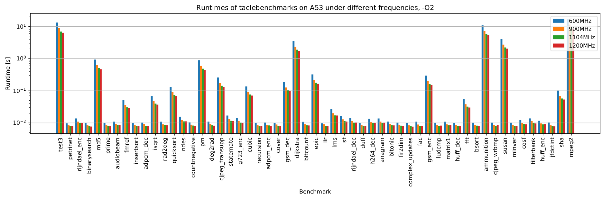
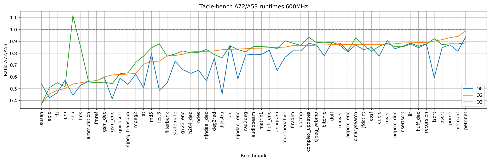
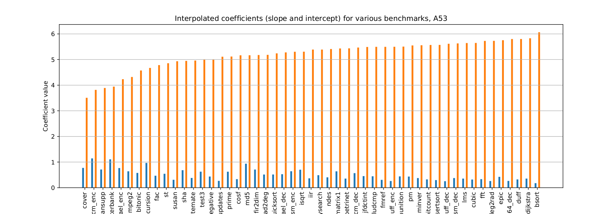
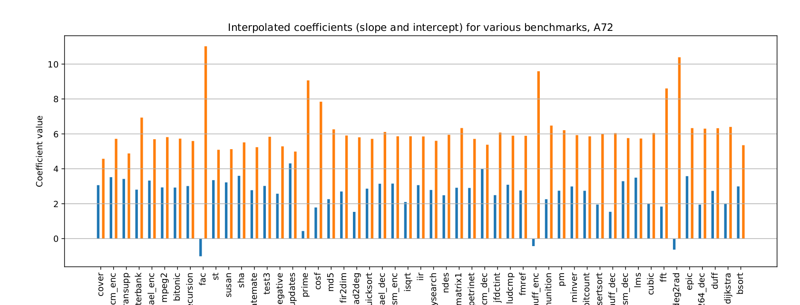
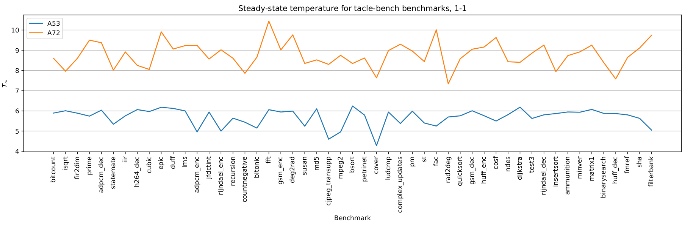
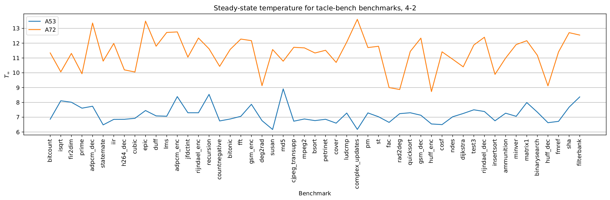
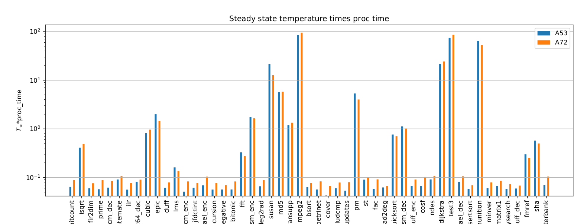

# Data z experimentálních měření

> Je třeba mít na paměti, že výsledky měření jsou předběžné a měření dále probíhají. Data mohou obsahovat outliery, nepřesnosti apod.

## Doby běhu

Benchmarky z tacle-benche (moduly kernel, sequential, test) byly zkompilovány s optimalizací `O0`, `O2` a `O3`. Před kompilací byly benchmarky upraveny tak, že volání funkce `<benchmark>_main` bylo obaleno `for` cyklem a opakováno 100x (cílem bylo minimalizovat vliv zavádění programu a zvýraznit charakter samotného výpočtu). Doba běhu byla měřena pomocí nástroje `perf stat` opakovaně (20 měření). Data obsahují průměrné časy.

Doby běhu byly měřeny pro všechny frekvence obou výpočetních clusterů. Každý benchmark běžel samostatně. 

Výsledky měření jsou v `.csv` souborech `runtimes_<Ox>.csv`.

Doby běhu pro `O2` kompilaci a `A53` cluster jsou znázorněny na následujícím obrázku:

Poměr mezi dobou běhu na frekvenci 600MHz mezi clustery A72 a A53 je znázorněn na následujícím obrázku:

Normalizované časy vůči frekvenci clusteru pro `A53 -O2` jsou znázorněny na následujícím obrázku:

## Teploty

Pro úroveň optimalizace `O2` byly jednotlivé benchmarky spuštěny pod DEmOSem na frekvenci 600MHz (oba clustery) - pro každý cluster bylo provedeno jedno měření, kdy byl benchmark alokován jen na jedno jádro a druhé měření, kdy byl benchmark alokovaný na všechna jádra daného clusteru. Každé měření probíhalo 15 minut se zapnutým větrákem (`-fan=0.5`). 

Na základě měření byla odhadnuta stabilní teplota (`Tinf`). Dále byla odhadnutými teplotami pro každý cluster proložena liteární funkce - snažící se aproximovat závislost výsledné teploty `Tinf` na počtu aktivních jader (měřeno pro 1 a 4 u `A53`; 1 a 2 u `A72`). Koeficienty lineární funkce vystupují v datech jako `slope` a `intercept`. 

 > Některé z benchmarků (g723_enc, cjpeg_wrbmp, audiobeam, anagram) možná nedoběhly správně kvůli chybám způsobeným opakováním volání funkce `<benchmark>_main`.

 Jsou přiloženy 2 soubory 
 
 - `temperatures_data.csv` - obsahuje pro daný benchmark a cluster výsledné odhady `Tinf` (a jistou míru konfidence v daný odhad `Tinf_err`) a 
 - `temperatures_data_interpolated.csv` - pro daný benchmark a afinitu obsahuje hodnoty `intercept` a `slope`. 

 Hodnoty `intercept` a `slope` pro A53 jsou znázorněny na následujícím obrázku:

 

 Hodnoty `intercept` a `slope` pro A72 jsou znázorněny na následujícím obrázku:
 (záporné hodnoty `slope` jsou zřejmě způsobeny chybou měření)

 

 Hodnoty Tinf pro jedno aktivní jádro, respektive celý cluster, ukazují másledující grafy:

 

 Hodnoty Tinf vynásobené dobou běhu jsou na následujícím obrázku:

 

 ## Váhy v našem modelu

 Bude třeba se dobře zamyslet, jaké váhy zvolit pro naše modely, případně jak modely upravit, aby výsledky odpovídaly fyzikální realitě. Pro syntetické experimenty sledující výkonnost modelů by stačili asi i váhy náhodné (generované z nějakém rozumném rozpětí).

 Přimočaře se nabízí vzít jako váhu každého tasku jen hodnotu `Tinf`. Problém je ten, že `Tinf` nebere v úvahu výkonnost clusterů (změny processing času pro různé alokace). Nabízí se tedy vztáhnout tuto hodnotu nějak vzhledem k processing času - např. vzít hodnotu `Tinf * p` na daném clusteru. (Možná přesněji `Tinf * p/MF`).
 
 Další problém je ovšem v tom, že pokud bude ve výsledku běžet několik tasků v jednom okně, součet jejich `Tinf` nebude odpovídat výsledné teplotě (proto rozdělujeme `Tinf` na slope a intercept - intercept by se pak měl započítat jen 1x pro dané okno, zatímco slope 1x pro každý task).

 Mohli bychom se tedy pokusit intercept vůbec neřešit - předpokládat, že pro všechny úlohy je stejný - a počítat jen se `slope` (případně slope * p). Nicméně se dopustíme systematické chyby - protože se zdá, že posun intercept u A72 je cca o 1 stupeň vyšší, než u A53. 

 Každopádně preference reprezentované vahami by nakonec nějak měly odpovídat tomu, co vidíme na grafu Tinf * p - tedy pro nějaký benchmark by měla být preference dávat ho na jeden cluster, pro jiný by měla být preference opačná. 
 
 Pokud bychom předpokládali, že celý cluster je vždy zaplněn (v každém okně), mohli bychom jako váhy volit něco jako `(slope + incercept/n_cores_in_cluster)*p`.

 Sám nevím, co bude dávat největší smysl a nejlepší výsledky, bude třeba to vyzkoušet. Dekomponovaný model v první fázi nevidí, jak budou jednotlivá okna vypadat, takže možná nemá dost informace, aby teploty predikoval přesně. Ale uvidíme.