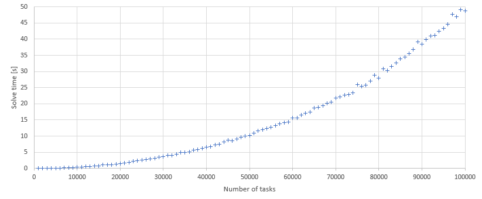

## Benchmark

Solver: Longest tasks first solver (with early inner loop exit)

Expected time complexity: O(n^2)

```
Input: list of tasks T
Output: list of windows W where each window w in W has tasks assigned to it

longest_task_first(T):
   W = {} 
   sort_tasks_by_processing_time_desc(T)

   while (T is not empty):
      w = {} 
      for each (task t in T):
         if (processing_capacity_available(t, w)):
           add t to w
           remove t from T

         if (all_primary_processors_full(w)):
           break

      add w to W

   return W
```

## Results

CPU: Intel Core i5 750 @ 2.67GHZ

Compiler: g++ (GCC) 8.2.0, optimization flags: `-O3 -march=native`


